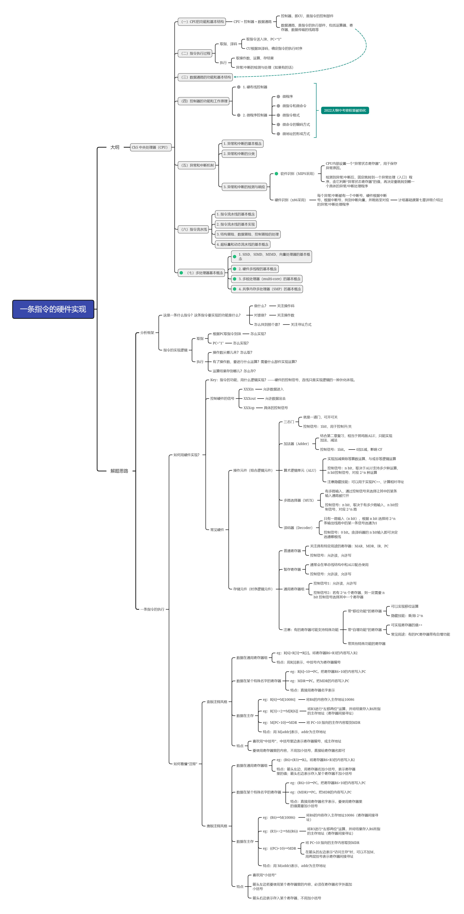

# CO

## TODO

数的表示

海明码

>对于计组第一遍也是跟紧王道，做好课后的选择和大题，山大以往的风格是只考大题，但今年计组却考了选择，所以一定要把王道的选择和大题都过一遍。虽然自己是零基础，也感觉没有网上说的太难，第一遍过完用了大概一个月，当时过完第一遍都10月中旬了，时间十分仓促。

>第二遍结合真题再过一遍王道的重要考点，山大计组真题很有特点，每年大题比较固定，几乎都会考画芯片和指令的两道大题，第二遍我自认为应该重点把这两道大题ko掉。

>第三遍继续过王道，将冷门考点，如海明码（今年栽了8分的大题，血的教训）一定得全过一遍，不要放过任何一个死角，你的懒惰便会造成考试的丢分。

[大纲](https://gitee.com/skd_lzh/master/raw/master/832%20%E5%A4%A7%E7%BA%B2_%E5%AE%98%E7%BD%91.pdf)

<https://zhuanlan.zhihu.com/p/676476825>

## 计算机系统概述

时间局部性:访问某条内容,短时间内可能再次被访问到

空间局部性:访问某条内容,其附近的内容短时间可能被访问到

PC的位数取决于存储器的容量和指令字长

MAR的位数取决于最多可寻址的存储单元的个数

传输速率里的K一般是10^3,存储里的K一般是2^10

### 字长

机器字长:CPU一次能处理的位数(与ALU相关) 指令字长与机器字长没有任何联系.

存储字长:一个存储单元能存储的数据大小

数组 $a[n][m]$ (注意区分a[0...n]实际上是n+1个元素,a[n]是n个元素) 以[0][0]起始,则行优先 a[i][j]的地址是$a+(i*n+j)*l$,列优先 a[i][j]的地址是$a+(j*m+i)*l$ 若以[1][1]起始,对应先把i和j都减一就好了.

## 存储

虚拟存储器主存和辅存之间的数据调动,涉及到操作系统等,因此对系统程序员不是透明的

CPU可以不经过Cache直接与内存进行数据交换

### RAM

SRAM:双稳态触发器 DRAM:栅极电容

DRAM 写同读反

#### DRAM的刷新

##### 什么是刷新?

刷新实质上是将原信息读出,再由刷新放大器形成原信息并重新写入.防止因栅极电容随着时间放电导致信息自动消失.(刷新不是解决破坏性读出的,破坏性读出由再生解决.)

##### 刷新和再生的区别

刷新以行为单位,再生仅仅是在读出某存储单元的数据时由于破坏性读出,再将对应的存储单元进行重写

集中刷新:隔一段时间全部刷新一次

分散刷新:每个存取周期中拿出一段时间刷新一行.(放到存取周期中刷新,那么也就没有死区了)

异步刷新:将刷新周期除以行数得到刷新间隔,每隔这些个刷新间隔,刷新一行(所以仍然有死区)

### Cache

设平均每条指令访存x次 Cache命中率为c

执行a条指令的时间为 $(t_{命中的时间花费}*c+t_{访存}*x*(1-c))*a$ (王道p129 t6(4))

设一秒内执行b条指令 一秒内访存次数:$b*(1-c)*x$ (王道p322 t8(1))

相联存储器不按地址而是按()访问的存储器,在Cache中用来存放(),在虚拟存储器中用来存放().

答:内容 行地址表 页表和段表

### 虚拟存储器

虚拟存储器要懂

##### 名词解释:虚拟地址

虚拟地址:即逻辑地址,是指由程序产生的与段直接相关的偏移地址部分. (2016 851)

### 外部存储器

##### 磁盘存储器的主要技术指标

存储密度 存储容量 平均存储时间 数据传输率  (2016 851给的是平均寻址时间,但期末题3和王道给的是平均存储时间)

## CPU

单周期CPU不能采用单总线结构,原因是单总线结构,一个时钟周期内只能传送一次数据,而单周期CPU在一个时钟周期内需要完成一个完整的指令过程(取指间址执行中断).

时钟周期 <= 机器周期 <= 指令周期

多路选择器(MUX): 传进去一个数,和多个数据,只有一个输出口输出其中一个数.

多路分配器: 传进去一个数,和一个数据,在多个输出口里指定一个口然后输出

译码器:有少量n个输入(这几个输入组成二进制),然后有2^n个输出口,使能这个输入代表的十进制数对应的高电平的口

写回阶段一般是向通用寄存器内写入.而对于转移指令:有条件跳转:在MEM阶段写入PC 无条件跳转:在EX阶段写入PC

##### 试比较组合逻辑控制方式和微程序控制方式的优缺点 (2016 851)

组合逻辑控制方式(硬布线控制方式):优点:执行速度快. 缺点:扩充修改比较困难.

微程序控制方式:优点:容易扩充修改,具有规整性,灵活性,可维护性. 缺点:执行速度慢.

### 流水线

#### 流水线的性能指标 (王道p258)

吞吐率TP = ? 

加速比 = ?

流水线的效率 = ?

## 总线

总线是构成计算机系统的互联机构,是多个系统功能 部件之间进行数据传送的公共通路(通道)

##### 什么是总线? (2016 851)

总线是一组能为多个部件()和()的公共信息传送线路. (2016 851)

## IO

### IO接口

IO接口(IO控制器)是主机和外设的(),通过接口可以实现信息交换(王道p300)

IO端口是IO接口电路中的一些寄存器.存放数据信息,控制信息,状态信息等,分别对应数据缓冲寄存器,控制寄存器,状态寄存器.(唐p185)

##### IO接口的功能(王道p300)

1.实现地址译码和设备的选择

2.实现主机和外设的通信控制

3.实现数据缓冲

4.实现数据格式转换(串-并,电平,模-数)

5.传送控制命令和状态信息

#### 编址

IO接口有哪些编址方式?各有何特点? (课后题5.1,王道p302)

统一编址和独立编址

统一编址优点:不需要专门的I/O指令.更加灵活方便.读写控制电路简单

统一编址缺点:端口占用主存地址空间,使主存地址空间变小.译码电路更复杂,速度慢.

独立编址优点:需要专门的I/O指令,程序更清晰,便于理解.I/O端口数远少于主存单元数,只需少量地址线,译码容易.寻址速度快.

独立编址缺点:程序设计灵活性差.CPU需提供 存储器读写 IO设备读写 两组控制信号,控制复杂.

##### 名词解释:设备驱动程序

设备驱动程序:与硬件直接相关,负责具体实现系统对设备发出的操作指令,驱动I/O设备工作的驱动程序

### 程序中断方式

什么是中断?(王道p307)

中断是在计算机执行程序的过程中,出现某些(),CPU暂时中止(),转而(),处理完毕后返回到原程序的(),继续执行原程序.

**中断服务程序一般是操作系统模块**.那么也就是说不同的操作系统对于中断的响应可能有不同的方式.

中断向量地址是存放中断向量的地址(比如 13H JMP 200 ,那么中断向量是200, 中断向量地址就是13H)

设备发出中断请求的条件:设备就绪(D=1)且该设备未被屏蔽(MASK=0) (唐p194)

CPU响应中断的条件:①中断源有中断请求②CPU允许中断以及开中断(异常和不可屏蔽中断不受此限制)③一条指令执行完毕(异常不受此限制)④外设中断允许触发器必须为"1"  (王道p308,p332)

中断隐指令的三个操作:关中断,保存断点,引出中断服务程序.

中断服务程序的操作:保存现场 (开中断)中断服务 (关中断)恢复现场 中断返回

多重中断:CPU在执行中断服务过程中,有优先级更高的中断请求,CPU暂停当前的中断服务程序,转而去执行新的中断请求.                                       

### DMA方式

DMA控制器按其组成结构,分为选择型和多路型两种

DMA的组成:

1.主存地址寄存器(AR)

2.字计数器(WC)

3.数据缓冲寄存器(BR)

4.DMA控制逻辑

5.中断机构

6.设备地址寄存器(DAR)

#### DMA的阶段

1. 预处理

CPU向DMA控制逻辑指明数据传送方向. 

CPU向DMA设备地址寄存器送入设备号,并启动设备. 

CPU向DMA主存地址寄存器送入交换数据的主存起始地址.

对字计数器赋予交换数据的个数.

2. 数据传送

当设备准备好一个字/或字节 时,发出选通信号,将该字读到DMA的数据缓冲寄存器(BR)中,表示数据缓冲寄存器满.

设备向DMA控制器发送DMA请求

DMA控制器向CPU发送总线请求

CPU发送总线响应信号,DMA接管总线控制权

传送完毕后DMA控制器修改主存地址和字计数值,判断数据块是否传送结束,若结束,则向CPU发送DMA中断请求.

3. 后处理

CPU响应DMA中断请求信号.(校验数据正确性,决定是否继续传送,若继续传送,则需要再初始化DMA接口)

#### DMA的传送方式

(1)停止CPU访存     优点:控制简单,适用于数据传输速率高的设备 缺点:DMA访问主存时,CPU基本不工作

(2)(主存的存取)周期挪用  优点:既实现了IO传送,又较好的发挥了内存和CPU的效率. 缺点:每次挪用主存周期,DMA接口都要申请,建立,归还总线的控制权

(3)DMA与CPU交替访存 优点:不需要申请,建立,归还总线的控制权,具有很高的传输速率. 缺点:硬件逻辑变得复杂

##### 中断方式和DMA方式有何异同点?各应用于哪些场合?(2016 851)

唐书P208

- 从数据传送看,中断方式靠()传送,DMA方式靠()传送
- 从CPU响应时间看,中断方式在()时响应,DMA方式在指令周期内的任一()周期结束时响应
- 程序中断方式有处理()的能力,DMA没有
- 中断方式需要中断现行程序,故需(),DMA方式不中断现行程序,除了预处理和后处理,其他时间不占用CPU任何资源
- DMA的优先级比中断方式优先级()
- 中断传送过程需要CPU的干预,DMA传送过程不需要CPU干预,适合高速外设.
- (补充) 中断请求的是CPU处理时间,DMA请求的是总线使用权

## 是否不考?

- 多处理器

