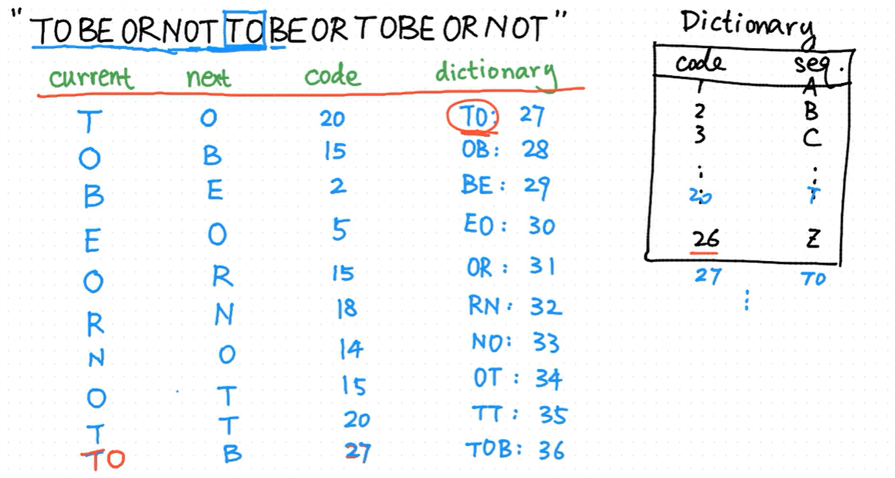
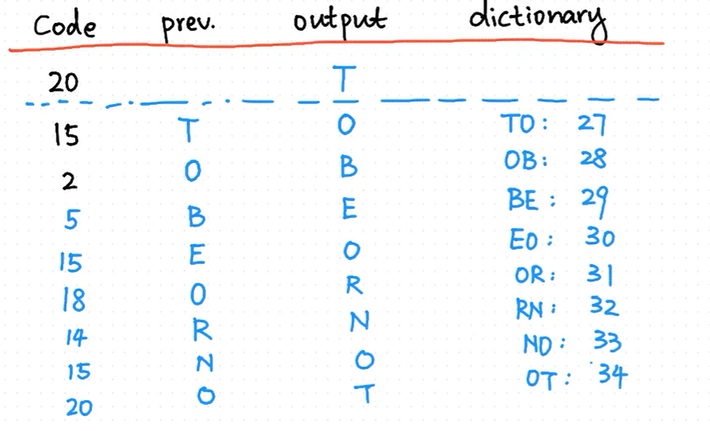

# DS

## 线性表

多对角矩阵公式推导https://blog.csdn.net/Photice/article/details/129889196

## 栈

n 个元素合法的出栈序列数有 $\frac {C^n_{2n}}{n+1}$

## 树

树的度是树中度数最大的节点的度

树的边数 = 树的所有节点的度的和 = 顶点数 - 1 (节点的度实际上是孩子的个数,与图中的度的定义并不同)

有n个结点的二叉树有 $n+1$ 个空链域

有序树: 树中的结点的各子树的左右次序不能互换. 人为规定二叉树是有序树.

**有序树若只有一个孩子,则无需区分左右次序.二叉树无论如何都有左右顺序**

m叉树高度为h,其最多有 $1 + m +m^2+...+m^{h-1} = \frac {m^h-1}{m-1}$ 个结点

### 二叉树

度为0的结点数 = 度为2的结点数 + 1. 易证.

两个兄弟节点,在前中后序遍历的相对位置是不变的
当两个结点前序序列为XY,后序为YX,则X为Y的祖先 王道P157T36

#### 折半查找判定树

要么左子树结点大于等于右子树结点,要么右子树结点大于等于左子树结点.若既有左子树大于右子树又有右子树大于左子树,那么这棵树一定不是折半查找判定树.

下取整时,左子树结点数小于等于右子树结点数.上取整反之.

并且,结点数的差值是0或1

## 图

邻接矩阵A, $A^n[i][j]$ 表示顶点 i 到 j 长度为 n 的路径的数目 

简单图:不存在重边和自环

注意和简单路径(路径上的顶点都不相同)区分.因此回路可能是简单图,但一定不是简单路径.

关键路径:从源点到汇点路径长度最长的路径(王道p248)

## 排序

对任意的 $n$ 个关键字进行的排序,至少需要多少次比较?

答:
假设整个排序过程至少需要做 $t$ 次比较，则显然会有 $2^t$ 种情况。由于 $n$ 个记录共有 $n!$ 种不同的排列,因而必须有 $n!$ 种不同的比较路径,于是有$2^t\geq n!$,即 $t≥\log_2(n!)$.
<!-- 设进行 $t$ 次比较,则有 $2^t$ 种选择, $n$ 个元素随机排列,有 $n!$ 种状态,我们每次做选择,都是在一个状态转到另一个状态,那么只要选择数 >= 状态数,一定可以从某个状态转移到 $123...n$ ,只要 $2^t\geq n! ,t>=\log n!$ -->

### LZW压缩

<https://www.bilibili.com/video/BV1Ds411G7p7/>

